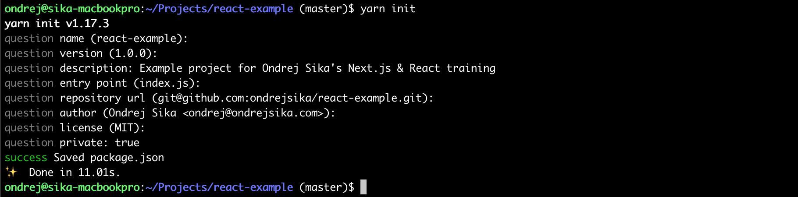

> This course is not finished yet and it is under intensive development. Try on own risk ;) If you found a bug or improvement, create issue or pull request. Or let me know by email. Thanks. -- Ondrej Sika

Are you interested in this course? Send me email to <ondrej@ondrejsika.com> and I can run this course in your company.

# React Training

    2019 Ondrej Sika <ondrej@ondrejsika.com>
    https://github.com/ondrejsika/react-training


Example repository to this training is [ondrejsika/react-example](https://github.com/ondrejsika/react-example)


## Install Node.js & Yarn

### Mac

```
brew install node
brew install yarn
```

## Gitignore & Editor Config

Before you start, you have to setup two things. Gitignore and Editor config. Why?

### Gitignore

You probably want to use Git. If your directory contain some files you don't want to manage using git, you have to ceate `.gitignote` and specify them there.

```gitignore
# .gitignore
node_modules
.next
out
.vscode
.DS_Store
```

If you want to know more about Git, check out my [Git Training](https://github.com/ondrejsika/git-training).

### Editor Config

Editor config is a file wich set up your editor to formatting standart defined in `.editorconfig` file. You can chose tabs or spaces, ident size and much more. Here is my basic config:

```editorconfig
# .editorconfig
root = true
[*]
indent_style = space
indent_size = 2
charset = utf-8
trim_trailing_whitespace = true
insert_final_newline = true
end_of_line = lf
max_line_length = null
```

## Init JavaScript project (package.json)

Create new `package.json` by:

```
yarn init
```

and fill the package info. It will be somethink like this:




## Install Next.js & React

```
yarn add next react react-dom
```

## Prettier

We use [Prettier](https://prettier.io/) as a code formater.

Install prettier as a development dependency.

```
yarn add --dev prettier
```

Install also VS Code extension for Prettier too.

You can also add scripts for prettier validation & auto reformat code.

```json
{
  "scripts": {
    "prettier-check": "prettier -l '**/*.js'",
    "prettier-write": "prettier --write '**/*.js'"
  }
}
```

You want reformat just your source code, not a node modules or minified build.
You have to create `.prettierignore` (with same syntax as .gitignore) and specify what you want ingnore.

```
node_modules/
out/
.next/
```

If you want to check all your project files, you can use `yarn run prettier-check`.
If you want to fix format of your js files, use `yarn run prettier-write`.

### Prettier pre commit hook

You can also create __pre commit hook__ which protect you from commit unformated code into repository.
If you want to check format before every commit, create pre commit hook by:

```sh
cat > .git/hooks/pre-commit <<EOF
#!/bin/sh

yarn run prettier-check

EOF
chmod +x .git/hooks/pre-commit

```

If you want to skip this validation you have to use `git commit` with `-n` or `--no-verify` parameter.


## Add Next.js scripts to `package.json`

```json
{
  "scripts": {
    "dev": "next",
    "build": "next build",
    "start": "next start"
  }
}
```


## Create a First Page

File `./pages/index.js`

```jsx
export default () => {
  return <div>Welcome to Next.js!</div>;
};
```


## Run App

```
yarn dev
```

See <http://127.0.0.1:3000>

Keep running, it will be updated automatically. Try it, change the `index.js`!

## Create Simple Component

Create file `./components/Hello.js`

```jsx
export default (Hello = props => {
  return (
    <>
      <h1>Hello {props.name}</h1>
    </>
  );
});
```

Use it in `index.js`

```jsx
import Hello from "../components/Hello";

export default () => {
  return (
    <>
      <Hello name="Zuz" />
    </>
  );
};
```

and check it out <http://127.0.0.1:3000>

## Basic Construct in JSX

You can write any javascript code inside `{}` in JSX (javascript with React components), but you have to put it into function.

### Conditions (If)

Instead of this:

```jsx
// pages/index.js
// NOT working example
import Hello from "../components/Hello";

export default () => {
  let name = "Zuz";
  return (
    <>
      {
        if (name) {
          <Hello name="Zuz" />
        }
        else {
          <h1>Hello unknown</h1>
        }
      }
    </>
  );
};
```

You have to put your JS code into function and call it.

```jsx
<>
  {(()=>{
    return ...
  })()}
</>
```

Your file will be like this.

```jsx
// pages/index.js
import Hello from "../components/Hello";

export default () => {
  let name = "Zuz";
  return (
    <>
      {(() => {
        if (name) {
          return <Hello name={name} />;
        }
        else {
          return <h1>Hello unknown</h1>
        }
      })()}
    </>
  );
};
```

### Multiple conditions

If you have more than one condition, it will be hard to that this way. You can create array and append components you want to render and then, return whole array (and will be rendered).

Create the example file `pages/multiple-if.js`:

```jsx
// pages/multiple-if.js
export default () => {
  let count = 2;
  return (
    <>
      {(() => {
        let out = [];
        if (count >= 1) {
          out.push(<h1>H1</h1>);
        }
        if (count >= 2) {
          out.push(<h2>H2</h2>);
        }
        if (count >= 3) {
          out.push(<h3>H3</h3>);
        }
        return out;
      })()}
    </>
  );
};
```

and see <http://127.0.0.1:3000/multiple-if>

### Loops

You can loop array very simply, like this:

```jsx
// pages/loops.js
export default () => {
  let fruits = ["orange", "apple", "banana"];
  return (
    <>
      <ul>
        {(() => {
          return fruits.map((el, i) => {
            return <li key={i}>{el}</li>;
          });
        })()}
      </ul>
    </>
  );
};
```

See <http://127.0.0.1:3000/loops>


## Add Styles to Component

Update our hello component like that:

```jsx
export default props => {
  return (
    <>
      <h1
        style={{
          color: "green",
          backgroundColor: "lightblue"
        }}
      >
        Hello {props.name}
      </h1>
    </>
  );
};
```

You can add styles using `style` property. Styles must be object, where key is camel case name of css property and value is string with its value.

Check it out <http://127.0.0.1:3000>


## Static Rendering

You need to add pages you want to render statically to `next.config.js`. You have to replace `module.exports = {};` with:

```jsx
module.exports = {
  exportTrailingSlash: true,
  exportPathMap: async function(defaultPathMap) {
    return {
      '/': { page: '/' },
    };
  }
};
```

Add static build script to `package.json`:

```json
{
  "scripts": {
    "static": "yarn run build && next export",
  }
}
```

Now you can build site using:

```
yarn run static
```

And see your statically builded website in `out/`.

Dont forget to add the `out` to `.gitignore`.


## Second Page

If you want create another page, you can create `pages/about-me.js`

```jsx
export default () => {
  return (
    <>
      <h1>About me</h1>
    </>
  );
};

```

You have to add that page also to `next.config.js`:

```js
module.exports = {
  exportTrailingSlash: true,
  exportPathMap: async function(defaultPathMap) {
    return {
      '/': { page: '/' },
      '/about-me': { page: '/about-me' },
    };
  }
};
```

Because you've edited Next.js config, you have to restart server.

Then, check it out <http://127.0.0.1:3000/about-me>. You can also build static site.

## Layout in `pages/_app.js` - Don't Repeat Yourself (DRY)

Create file `pages/_app.js` which defines your's app layout. You can also import CSS there:

```jsx
import React from "react";
import App, { Container } from "next/app";

class MyApp extends App {
  render() {
    const { Component, pageProps } = this.props;

    return (
      <Container>
        <p>
          <a href="/">Index</a> ~ <a href="/about-me">About me</a>
        </p>
        <Component {...pageProps} />
      </Container>
    );
  }
}

export default MyApp;
```

Check it out <http://127.0.0.1:3000>


## Add CSS & Bootstrap

You have to install [Bootstrap](https://getbootstrap.com/) first.

```
yarn add bootstrap
```

Then you have to install & configure Next.js CSS plugin. Install it by:

```
yarn add @zeit/next-css
```

And add to bottom of `config.next.js`:

```js
const withCSS = require("@zeit/next-css");
module.exports = withCSS(module.exports);
```

After any change in `config.next.js` you have to restart dev server.

Now, you can import style to your `_app.js`. Just add import of css:

```jsx
// _app.js

// Imported CSS
import "bootstrap/dist/css/bootstrap.css";
```

Now, you can use Bootstrap, for example add conteiner into your layout in `_app.js`,
your file will be like this:

```jsx
import React from "react";
import App, { Container } from "next/app";

// Imported CSS
import "bootstrap/dist/css/bootstrap.css";

class MyApp extends App {
  render() {
    const { Component, pageProps } = this.props;

    return (
      <Container>
        <div className="container">
          <p>
            <a href="/">Index</a> ~ <a href="/about-me">About me</a>
          </p>
          <Component {...pageProps} />
        </div>
      </Container>
    );
  }
}

export default MyApp;
```

## Deploy to zeit.co

### Install `now`

```
yarn global add now
```

### Create Now Config

Create `now.json`:

```json
{
  "version": 2,
  "name": "react-example",
  "builds": [
    {
      "src": "package.json",
      "use": "@now/static-build",
      "config": { "distDir": "out" }
    }
  ]
}
```

and add script to `package.json`:

```json
{
  "scripts": {
    "now-build": "yarn run static"
  }
}
```

### Deploy it

Just call

```
now
```

See your deployment on Zeit, eg.: <https://react-example.ondrejsika.now.sh>

## Add Images

If you want to use images in Next.js you have to add [next-images](https://www.npmjs.com/package/next-images) plugin.

### Install next-images plugin

```
yarn add next-images
```

### Add to `next.config.js`

Add those lines to bottom of your `next.config.js`

```js
const withImages = require('next-images')
module.exports = withImages(module.exports)
```

And restart your dev server.


### Download Example Image

```
mkdir data
curl -o data/nela.jpg https://raw.githubusercontent.com/ondrejsika/react-training/master/nela.jpg
```

### Use in Page

Now, you can add images to your site using two similar ways.

### Import Image

At first, import image

```js
import nela_img from "../data/nela.jpg";
```

And use it

```jsx

```

#### Require from JSX

Just use require in JSX

```jsx

```

Now, you can check it on <http://127.0.0.1:3000>

### Pages in MDX

[MDX](https://mdxjs.com) is Markdown for component era - Markdown + React Components

Official documentation for MDX & Next.js - <https://mdxjs.com/getting-started/next/>

#### Install MDX

```
yarn add @next/mdx @mdx-js/loader
```

#### Update Next.js config

Add to `module.exports` this `pageExtensions: ['js', 'jsx', 'mdx']`.

It will be look like:

```js
module.exports = {
  pageExtensions: ['js', 'jsx', 'mdx'],
  exportTrailingSlash: true,
  exportPathMap: async function(defaultPathMap) {
    return {
      '/': { page: '/' },
      '/about-me': { page: '/about-me' },
    };
  }
};
```

And you have to add plugin for MDX to bottom of your Next.js config:

```js
const withMDX = require('@next/mdx')({})
module.exports = withMDX(module.exports)
```

#### Create MDX page

You have to create a page with `.mdx` suffix in your `pages` dir, for example `pages/mdx.mdx` whith content:

```mdx
import Hello from '../components/Hello';

<Hello name='MDX!'/>

This is a [Next.js](https://nextjs.org) page written in MDX (Markdown + React Components).

## This is H2 Header

Some text.

### This is H3 Header

  And some code
```

You can also add link to this page to navigation in file `pages/_app.js`:

```jsx
<a href="/">Index</a> ~ <a href="/about-me">About me</a> ~ <a href="/mdx">MDX</a>
```

And you have to add page `/mdx` to static build configuration in your Next.js config. File `next.config.js` will be look like:

```js
module.exports = {
  pageExtensions: ['js', 'jsx', 'mdx'],
  exportTrailingSlash: true,
  exportPathMap: async function(defaultPathMap) {
    return {
      '/': { page: '/' },
      '/about-me': { page: '/about-me' },
      '/mdx': { page: '/mdx' },
    };
  }
};

const withImages = require('next-images')
module.exports = withImages(module.exports)

const withCSS = require("@zeit/next-css");
module.exports = withCSS(module.exports);

const withMDX = require('@next/mdx')({})
module.exports = withMDX(module.exports)
```

And that's it. Try `yarn run dev` and see <http://127.0.0.1:3000/mdx> or check out static build using `yarn run static`.


## Data in JSON & YAML

### JSON

Create example json file `data/demo.json`:

```json
["Apple", "Orange", "Banana"]
```

You can import JSON into Next.js directly without any configuration. Just import json file like this:

```jsx
// index.json
import json_file from "../data/example.json";
```

And add usage of data (add to `index.js`):


```jsx
// index.json
<h2>JSON Data</h2>
<ul>
  {json_file.map((el, i) => {
    return <li key={i}>{el}</li>;
  })}
</ul>
```

### YAML

You need a plugin ([next-yaml](https://github.com/ondrejsika/next-yaml)) for loading YAML files. You have to install it:

```
yarn add next-yaml
```

And use it in `config.next.js`, add to botom of file:

```js
// next.config.js

const withYAML = require("next-yaml");
module.exports = withYAML(module.exports);
```

and restart dev server.

Create example YAML `data/example.yaml`:

```yaml
# data/example.yaml
- Apple
- Orange
- Banana
```

Now, you can import & use YAML (.yaml & .yml) as JSON files described before.
Just import YAML in `index.js` and use it:

```jsx
// index.json
import yaml_file from "../data/example.yaml";
```

And add usage of data (add to `index.js`):

```jsx
// index.json
<h2>YAML Data</h2>
<ul>
  {yaml_file.map((el, i) => {
    return <li key={i}>{el}</li>;
  })}
</ul>
```

## You are almost done

This course is over, but your journey continues on your own projects. Let me know, how was the cours. Send me email to <ondrej@ondrejsika.com>.

If you like the course, please Tweet some recommendation with my Twitter handle [@ondrejsika](https://twitter.com/ondrejsika) or add me on LinkedIn [/in/ondrejsika](https://linkedin.com/in/ondrejsika) and write me a recomendation.

In case of any questions, let me know by email.
